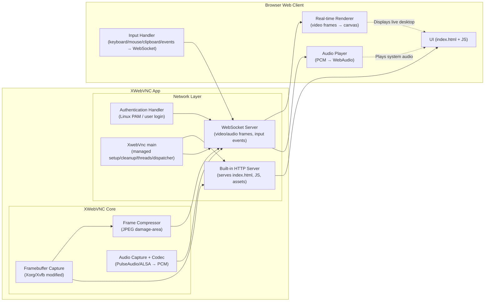

# 🖥️ XWebVNC Server [](https://github.com/jishan484/xWebVNC/actions/workflows/main.yml)

[**XWebVNC**](https://github.com/jishan484/xWebVNC/releases/tag/v1.0.0-stable) is an efficient, headless **Xorg/Xvfb-based display server** with built-in **WebVNC** capability — allowing you to stream and interact with your Linux desktop directly from any modern web browser.

---

## 💾 Install and setup
run the below command
```bash
curl -s https://raw.githubusercontent.com/jishan484/xWebVNC/main/install.sh | bash
```
> This will install the required dependencies and set up Xvfb. Once installed, you can start your desktop manager or any GUI application on the designated DISPLAY number.
> If the authentication option is chosen during setup, you must log in using your **Linux username and password**. At present, the system allows any Linux user, including root, to log in.

## 🚀 Features

- 🧠 **Headless X Server** — Works as either **Xorg** or **Xvfb**, optimized for headless environments.
- 🌐 **Built-in WebSocket & HTTP Server** — Serves both the web client and live framebuffer updates.
- ⚡ **Real-Time Compression** — Supports:
  - **JPEG** → High compression ratio with good visual fidelity
- 🪶 **Zero External Dependencies** — No x11vnc, no nginx, no proxies.
- 🔒 **Lightweight & Secure** — Ideal for servers, embedded systems, or containerized setups.
- 🧩 **Fully Self-Contained** — Includes built-in `index.html` client page.
- 🖱️**local mouse** -> use local mouse like few good webvnc app
- 🔊**Audio support** -> audio can be enabled with pulseaudio (need install it separately to enable audio).
- 📋**clipboard support** -> app uspports one way clipboard (client to server). keys: `CTRL + SHIFT + V`. to paste to terminal which needs ctrl+shift+v, you must change the key combination of terminal paste or paste it to other text pad and copy paste it from there. (this will be fixed in v1.0.2)

---

## 🧪 Example Use Cases
- Remote GUI access for headless Linux servers
- Browser-based desktops in Docker or VMs
- Lightweight remote development environments
- Embedded Linux systems with browser-based control

# build and run it youself
- prep the system
  ```sh
  apt-get update
  apt-get install -y meson ninja-build pkg-config python3 python3-pip build-essential git x11-xkb-utils libjpeg-dev
  ```
- run build dependencies
  ```bash
  bash .gitlab-ci/debian-install.sh
  ```
- setup and build
  ```sh
  meson setup build
  meson compile -C build
  ```
  
example command `meson compile -C build && ./build/hw/vfb/Xvfb :1 -screen 0 1280x720x24 -web 80`

## 🖼️ Screen Shot
<center></center>

## 🧩 Architecture




